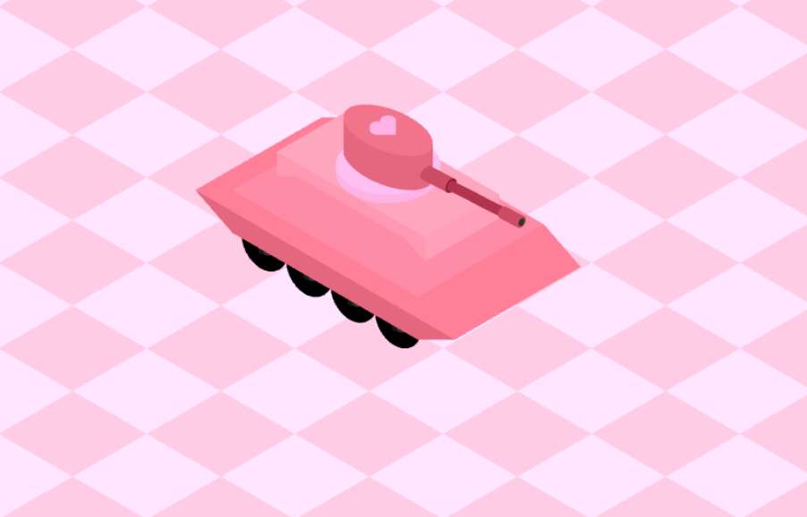

# CGI WebGL modeled tank, in pink

To run, you may clone the project, or go [here](https://maria-contins.github.io/Tank/)! :)

## Controls
Control | Key
--------|--------
Move Forwards | <kbd>up</kbd>
Move Backwards | <kbd>down</kbd>
Shoot | <kbd>space</kbd>
Move turret Up | <kbd>w</kbd>
Move turret Down | <kbd>s</kbd>
Solid Mode | <kbd>S</kbd>
Wireframe Mode | <kbd>W</kbd>

## Made with:

* [**Cláudio Guerra**](https://github.com/claudiofcguerra)
